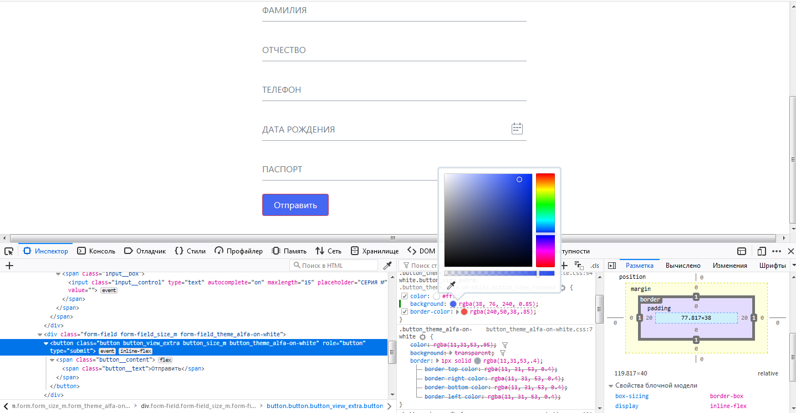

# Домашнее задание к занятию 1.2. «Основы клиент-серверного взаимодействия»

## Задание 1

Один из распространенных кейсов для тестирования — тестирование веб-формы для регистрации или отправки данных. Подобные формы есть практически на любом сайте и веб-сервисе. 

Вы работаете с анкетой на получение банковской карты, которая включает 6 полей (имя, фамилия, отчество, телефон, дата рождения, серия и номер паспорта). 

На первый взгляд форма выглядит работоспособной. Вам нужно проверить, доходят ли данные клиента до сервера. Если возникает ошибка, то определить в какой момент она происходит и передать информацию разработчику.

## Что нужно сделать:
1. Откройте веб-страницу с анкетой: http://zayavka-na-kartu-2.sdew.ru/;
2. Заполните анкету;
3. Откройте консоль и определите, в какой момент возникает ошибка;
4. Опишите статусы, которые удалось получить (код ответа, что видит пользователь, что мы видим в консоли, какую информацию мы передадим программистам и почему её, и пр.)

### Подсказка:
в поля ввода (ФИО) можно внести:
- редирект
- потерян
- плохой
- неавторизованный
- чайник
- ошибка

И получить соответствующий статус.

## Ответ: 
После ввода данных и нажатии кнопки "Отправить" save.php обрабатывает переданные данные из формы и выдает:
 -----
 - если все данные введены верно: 
The HTTP 412 Precondition Failed клиентский код ответа на ошибку указывает, что доступ к целевому ресурсу был отклонен. Это происходит с условными запросами на методы, отличные от  GET или HEAD, когда условие определено If-Unmodified-Since или {HTTPHeader("If-None-Match")}} не выполняется. В этом случае запрос, обычно загрузка или изменение ресурса, не может быть выполнен, и этот ответ об ошибке отправляется обратно.

 - редирект:
The HTTP 301 Moved Permanently" перенаправляет код ответа на статус, указывающий, что запрошенный ресурс был окончательно перемещен в URL, указанный  Location. Браузер перенаправляется на эту страницу, а поисковые системы обновляют свои ссылки на ресурс.

- потерян:
Код ответа на ошибку HTTP 404 Not Found указывает, что сервер не может найти запрошенный ресурс. Этот код ответа, вероятно, является самым известным из-за его частотности в сети.

- плохой:
Код состояния ответа "HTTP 400 Bad Request" указывает, что сервер не смог понять запрос из-за недействительного синтаксиса. Клиент не должен повторять этот запрос без изменений.

- неавторизованный:
Код ответа на статус ошибки  HTTP 401 Unauthorized клиента указывает, что запрос не был применен, поскольку ему не хватает действительных учетных данных для целевого ресурса.

- чайник:
HTTP код ошибки 418 I'm a teapot сообщает о том, что сервер не может приготовить кофе, потому что он чайник. Эта ошибка ссылается на Hyper Text Coffee Pot Control Protocol (гипертекстовый протокол кофейников) который был первоапрельской шуткой в 1998 году.

- ошибка:
Код ответа на ошибку сервера 500 Internal Server Error  указывает, что сервер столкнулся с неожиданным условием, которое помешало ему выполнить запрос.

-----

Ну и немного насчет UX: очень не удобная форма: Имя, Фамилия, Отчество, когда как люди привыкли везде вводить Ф. И. О., также при выборе даты рождения надо ставить дату по умолчанию где нибудь на 01.01.1980 (вычислить средний возраст заемщиков), чтобы не листать полдня в поисках своей даты рождения.

## Задание 2 `*` Дополнительная задача более сложного уровня:

В ходе юзабилити тестирования выяснилось, что красный цвет не очень нравится нашим пользователям и они хотят что-то поспокойнее. Наш дизайнер в отпуске, а программисты хотят начать работу над этим прямо сейчас. Вы решили помочь разработчикам в этом. 

Откройте тестовую веб-страницу с формой: http://zayavka-na-kartu-2.sdew.ru/. Найдите текст на странице и измените его размер и цвет. Измените расположение текста относительно других элементов на странице.

Результат ДЗ: скриншот с исходной и получившейся страницей.

## Ответ: 

